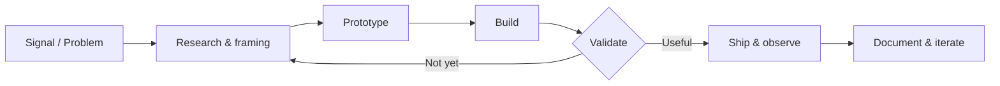
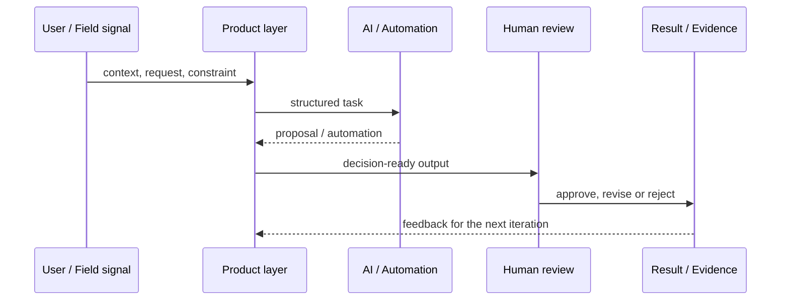

<div align="center">
  <a href="https://github.com/Victor-Enginner">
    
  </a>
</div>

<p align="center">
  <code>AI ENGINEERING</code> · <code>AUTOMATION</code> · <code>PRODUCT SYSTEMS</code> · <code>ETHICAL SECURITY</code>
</p>

<p align="center">
  <a href="https://github.com/Victor-Enginner?tab=repositories"></a>
  <a href="https://github.com/Victor-Enginner"></a>
</p>

---

```text
┌─[ victor@cyberdek ]─[ ~/mission ]
└──╼ $ whoami

AI engineer focused on turning complex ideas into useful software:
intelligent workflows, automations, interfaces and systems that ship.
```

## `//` Core stack

<p>
  
</p>

## `//` Selected systems

| Project | What it represents | Stack |
| :-- | :-- | :-- |
| [Portfolio](https://github.com/Victor-Enginner/Portf-lio) | Personal product and interface exploration | TypeScript |
| [Intelligence](https://github.com/Victor-Enginner/intelligence) | Experiments around intelligent applications | TypeScript |
| [Farol](https://github.com/Victor-Enginner/farol) | Mission-driven hackathon MVP | TypeScript |
| [AI Experiments](https://github.com/Victor-Enginner/Ai-Experiments) | Practical AI research and prototypes | AI / experiments |

## `//` Operating principles

```text
01. Build small, test early, iterate fast.
02. Automate the repetitive; reserve judgment for the important.
03. Security, privacy and responsible AI are product requirements.
04. Good engineering is clear, maintainable and useful to people.
```

## `//` Connect

<p>
  <a href="https://github.com/Victor-Enginner"></a>
  <!-- Add LinkedIn, e-mail and portfolio URLs here once they are ready. -->
</p>

<div align="center">
  <sub>Designed as a living engineering log — not a static résumé.</sub>
</div>

## `//` Systems map



> The work is organized around a simple rule: every feature should connect a real signal to an observable outcome.

## `//` Engineering loop



## `//` Semantic contract

```json
{
  "$schema": "https://json-schema.org/draft/2020-12/schema",
  "identity": {
    "handle": "Victor-Enginner",
    "role": "AI Engineer",
    "mission": "Build intelligent systems that turn complex signals into useful action"
  },
  "operating_model": {
    "inputs": ["user context", "operational signals", "constraints"],
    "methods": ["product thinking", "automation", "human-in-the-loop AI"],
    "outputs": ["working software", "auditable decisions", "measurable improvement"]
  },
  "principles": [
    "privacy and security by design",
    "evidence over hype",
    "iterate in public when possible"
  ]
}
```

## `//` Current vectors

| Vector | Building toward | Evidence |
| :-- | :-- | :-- |
| Agentic systems | Human-guided workflows and autonomous task coordination | [Intelligence](https://github.com/Victor-Enginner/intelligence) |
| Civic / operational impact | Signals turned into traceable missions | [Farol](https://github.com/Victor-Enginner/farol) |
| Product interfaces | Clear, fast interfaces for complex systems | [Portfolio](https://github.com/Victor-Enginner/Portf-lio) |

## `//` Note on motion

The header is intentionally animated as a small live signal. The architecture remains text-native, fast to load, accessible and readable in both light and dark GitHub themes.
