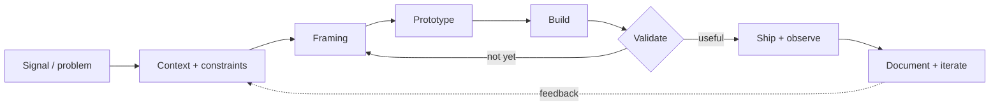
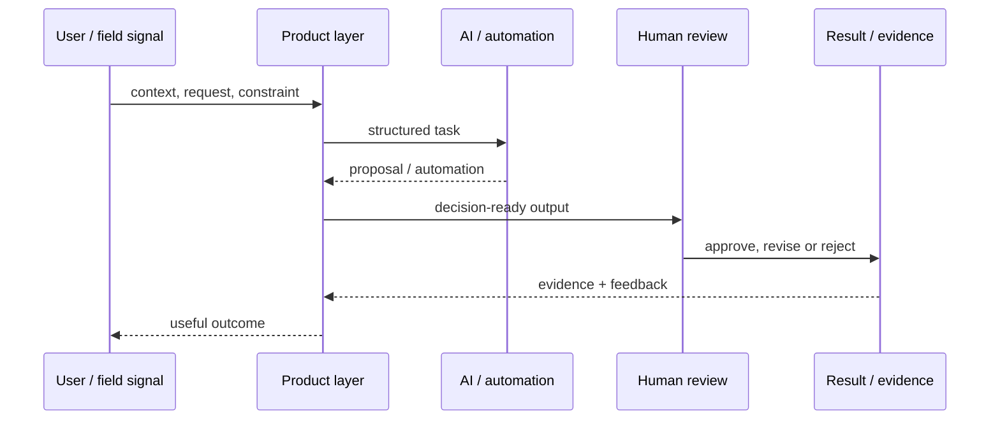
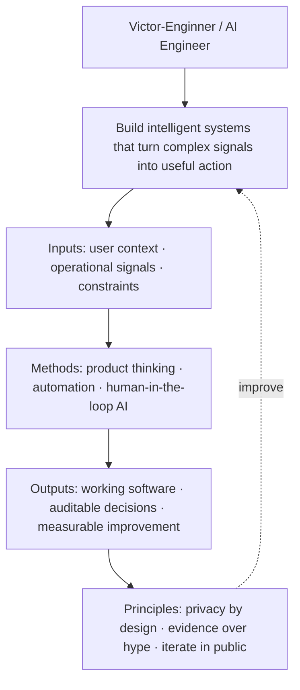

<div align="center">

# `VICTOR-ENGINNER`

### AI ENGINEERING · AUTOMATION · PRODUCT SYSTEMS · ETHICAL SECURITY


<br />

> Turning complex signals into useful software: intelligent workflows, automations,
> interfaces and systems that ship.

</div>

```bash
┌─[ victor@cyberdek ]─[ ~/mission ]
└──╼ $ whoami

AI engineer focused on turning complex ideas into useful software.
I design the path from signal → reasoning → action → observable outcome.
```

## `//` Core stack

### Languages & runtime


### Interfaces & product layer


### Data, AI & delivery


My working toolkit combines typed product engineering, Python-based AI experiments,
API and automation design, relational data, versioned delivery and security-minded
operational practices. The stack changes with the problem; the contract does not:
make the system useful, inspectable and maintainable.

## `//` What I build

| Vector | Building toward | Evidence |
| --- | --- | --- |
| Agentic systems | Human-guided workflows, tool use and autonomous task coordination | [Intelligence](https://github.com/Victor-Enginner/intelligence) |
| Automation | Repetitive work reduced to explicit, testable steps | [AI Experiments](https://github.com/Victor-Enginner/Ai-Experiments) |
| Product interfaces | Clear, fast interfaces for complex systems | [Portfolio](https://github.com/Victor-Enginner/Portf-lio) |
| Civic / operational impact | Signals turned into traceable missions | [Farol](https://github.com/Victor-Enginner/farol) |
| Ethical security | Privacy, least privilege and responsible AI as product requirements | Public engineering log |

## `//` Selected systems

| Project | What it represents | Stack / role |
| --- | --- | --- |
| [Portfolio](https://github.com/Victor-Enginner/Portf-lio) | Personal product and interface exploration | TypeScript · UI engineering |
| [Intelligence](https://github.com/Victor-Enginner/intelligence) | Experiments around intelligent applications | TypeScript · AI systems |
| [Farol](https://github.com/Victor-Enginner/farol) | Mission-driven hackathon MVP | TypeScript · product systems |
| [AI Experiments](https://github.com/Victor-Enginner/Ai-Experiments) | Practical AI research and prototypes | Python · AI / experiments |
| [Órbita Studio](https://github.com/Victor-Enginner/orbita-studio) | Frontend operational studio for content production | JavaScript · interface systems |
| [Football Blitz Card](https://github.com/Victor-Enginner/Football-Blitz-Card) | Public experiment with data, game logic and presentation | Python · product prototype |

## `//` Systems map

The work is organized around one rule: every feature should connect a real signal to
an observable outcome.



## `//` Engineering loop



## `//` Semantic graph



## `//` Semantic contract

```json
{
  "$schema": "https://json-schema.org/draft/2020-12/schema",
  "identity": {
    "handle": "Victor-Enginner",
    "role": "AI Engineer",
    "mission": "Build intelligent systems that turn complex signals into useful action"
  },
  "operating_model": {
    "inputs": ["user context", "operational signals", "constraints"],
    "methods": ["product thinking", "automation", "human-in-the-loop AI"],
    "outputs": ["working software", "auditable decisions", "measurable improvement"]
  },
  "principles": [
    "privacy and security by design",
    "evidence over hype",
    "iterate in public when possible"
  ]
}
```

## `//` Operating principles

```text
01. Build small, test early, iterate fast.
02. Automate the repetitive; reserve judgment for the important.
03. Security, privacy and responsible AI are product requirements.
04. Prefer evidence, observability and clear failure modes over hype.
05. Good engineering is clear, maintainable and useful to people.
```

## `//` Connect

- GitHub: [@Victor-Enginner](https://github.com/Victor-Enginner)
- Portfolio: [Portf-lio](https://github.com/Victor-Enginner/Portf-lio)
- Open to: AI engineering · automation · product systems · ethical security

<div align="center">

_Designed as a living engineering log — not a static résumé._

</div>
